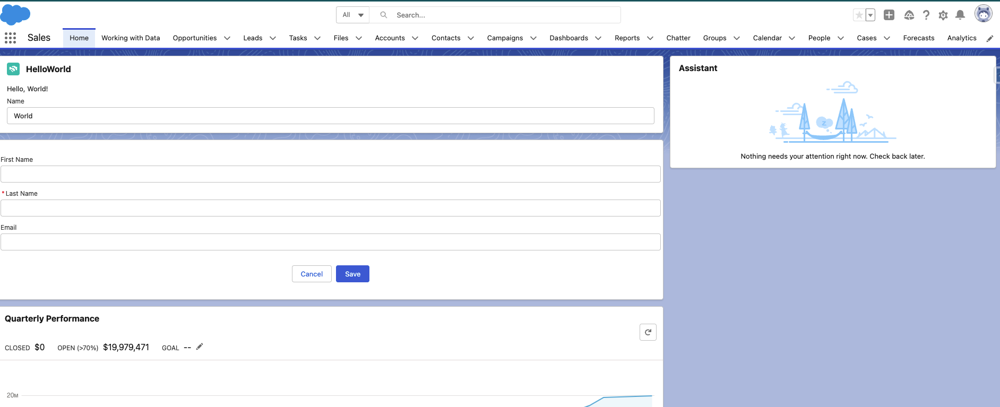

# LWC-Projects
<h2>LWC- Hello World:</h2>

 

 
 
   

<h2>Contact Creator:</h2>

 Deploy a Component for Creating Contacts

Use lightning-record-form to create a Lightning web component that allows you to create contact records. 

 

 
 
   

<h2>Account Creator:</h2>

 Deploy a Component for Creating Accounts

Use lightning-record-form to create a Lightning web component that allows you to create account records. 

 

 
 
   

<h2>Account List:</h2>

 Displays a list of existing Accounts in a lightning-datatable

Use lightning-record-form to create a Lightning web component that allows you to create account records. 

 

 
 
   

teamWorkLWC/TeamWork.png
<h2>Account List:</h2>

 Requirement: 
 
1. Create above LWC component and embed it on a lightning page. 
 
2. Make it available to Lightning__AppPage, Lightning__HomePage and Lightning__RecordPage 
in the configuration file. 
 
3. When a user fills first name and last name input fields and clicks Click button, an alert 
message needs to be popped up and “Hello {entered first name} {entered last name}” needs to 
be presented in alert window like below. 
 
 
  

Use lightning-record-form to create a Lightning web component that allows you to create account records. 

 

 
 
   
  
 
 
   
   

   <h2>Calculator:</h2>

Use lightning-record-form to create a Lightning web component that allows you to do basic calculations. 

 

 
 
   
